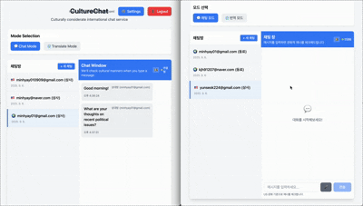

# Team 30 : CultureChat

Amazon Q Developer Hackathon으로 구현하고자 하는 아이디어를 설명합니다.

## 어플리케이션 개요

모든 대화 상황에서 **적절한 매너와 예의**를 지킬 수 있도록 도와주는 AI 기반 채팅 서비스입니다. 단순히 국적이나 언어에 국한되지 않고, **상대방과의 관계, 상황, 맥락**을 종합적으로 분석하여 가장 적절한 커뮤니케이션 방식을 제안합니다.

AWS Bedrock의 Claude 3 모델을 활용하여 **관계별 맞춤형 매너 가이드**를 제공하고, 상황에 맞는 정중하고 적절한 표현을 실시간으로 제안합니다.

## 주요 기능

### 1. 실시간 문화적 매너 분석
- 사용자가 입력한 메시지를 AWS Bedrock으로 실시간 분석
- 문화적으로 부적절한 표현 감지 시 경고 알림
- 적절한 표현일 경우 "👍매너 굿!" 피드백 제공

### 2. 관계 기반 매너 분석
- **관계별 맞춤 분석**: 친구, 동료, 상사, 고객, 가족, 선후배 등 모든 관계 유형 지원
- **상황별 톤앤매너**: 비즈니스, 일상, 공식적/비공식적 상황에 맞는 적절한 표현 제안
- **예의 수준 조절**: 관계의 친밀도와 격식 수준에 따른 자동 매너 조정
- **맥락 인식**: 대화의 흐름과 상황을 파악하여 가장 적절한 응답 방식 가이드

### 3. 스마트 매너 가이드
- **관계별 표현법**: 각 관계에 최적화된 정중하고 적절한 표현 방식 제안
- **격식 수준 선택**: 친근체 → 준격식체 → 격식체 3단계 매너 옵션
- **상황 인식 조정**: 축하, 사과, 요청, 거절 등 상황에 맞는 적절한 표현 가이드
- **실시간 매너 체크**: 무례하거나 부적절한 표현을 즉시 감지하고 개선안 제시

### 4. 실시간 채팅 시스템
- WebSocket 기반 실시간 메시지 송수신
- 채팅방 생성 및 관리 기능
- DynamoDB를 통한 메시지 영구 저장
- 연결 상태 실시간 표시

### 5. 직관적인 사용자 인터페이스
- 실시간 채팅 형태의 친숙한 UI
- 시각적 피드백 (경고/승인 표시)
- 반응형 디자인으로 다양한 디바이스 지원


*메인 화면: 관계 설정 및 채팅방 생성*


*채팅 화면: 실시간 매너 분석 및 피드백*


*대안 제안: 부적절한 표현 감지 시 개선안 제시*

## 동영상 데모

Amazon Q Developer로 구현한 CultureChat 어플리케이션의 데모 영상입니다.



*실시간 매너 분석 및 대안 제안 기능 시연*

## 리소스 배포하기

해당 코드를 AWS 상에 배포하기 위한 방법을 설명합니다.

### AWS 아키텍처


### 배포 단계

#### 1. 환경 설정
```bash
# AWS CLI 설정
aws configure

# 의존성 설치
npm install
```

#### 2. 인프라 배포
```bash
# CDK 배포 (DynamoDB, Lambda, API Gateway)
npm run deploy:infra

# Bedrock 권한 설정
npm run setup:bedrock
```

#### 3. 어플리케이션 배포
```bash
# 프론트엔드 빌드 및 배포
npm run build
npm run deploy:frontend

# WebSocket 서버 배포
npm run deploy:websocket
```

### 배포된 리소스
- **Frontend**: AWS Amplify
- **API**: AWS Lambda + API Gateway
- **Database**: AWS DynamoDB
- **AI Service**: AWS Bedrock (Claude 3)
- **Real-time**: AWS API Gateway WebSocket
- **Authentication**: AWS Cognito
- **Monitoring**: AWS CloudWatch

### 리소스 삭제
```bash
# 전체 스택 삭제
npm run destroy

# 개별 리소스 삭제
npm run destroy:frontend
npm run destroy:infra
```

## 프로젝트 기대 효과 및 예상 사용 사례

### 기대 효과
- **관계별 맞춤 소통**: 상대방과의 관계에 따른 적절한 커뮤니케이션 스타일 학습
- **문화적 갈등 예방**: 무의식적인 문화적 실수로 인한 오해 방지
- **글로벌 커뮤니케이션 향상**: 관계와 문화를 고려한 더 세밀한 소통 능력 개발
- **사회적 예의 학습**: 다양한 관계에서의 적절한 존댓말과 매너 습득

### 예상 사용 사례
- **직장 내 소통**: 상사, 동료, 후배와의 관계별 적절한 커뮤니케이션
- **고객 서비스**: 고객과의 정중하고 전문적인 대화
- **국제 비즈니스**: 해외 파트너와의 문화적 배려가 담긴 소통
- **교육 환경**: 선생님, 학생, 동급생과의 관계별 적절한 대화
- **일상 관계**: 가족, 친구, 지인과의 상황별 매너있는 소통
- **온라인 커뮤니티**: SNS, 게임, 포럼에서의 예의바른 소통

### 시장 임팩트
- **글로벌 커뮤니케이션 시장**: 연간 성장률 15% 이상의 고성장 시장
- **AI 기반 언어 서비스**: 매너와 예의까지 고려한 차별화된 서비스
- **기업 교육 시장**: 직장 내 소통 교육 및 컨설팅 서비스로 확장 가능
